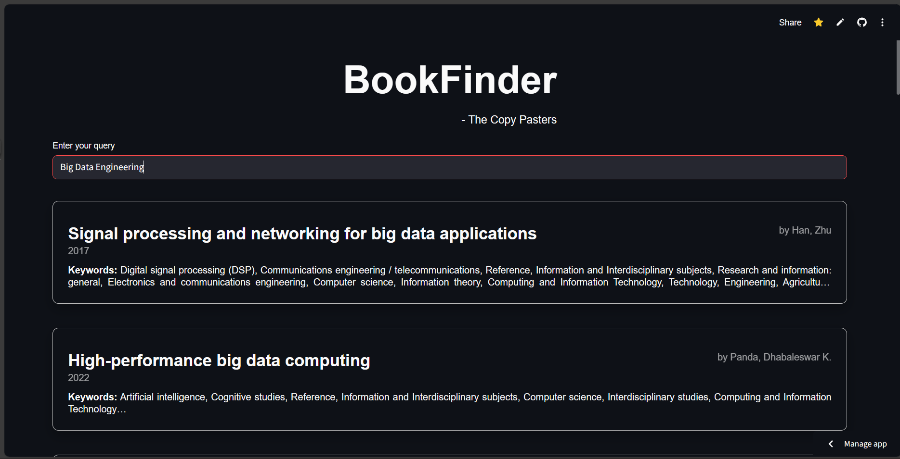

# BookFinderDS

BookFinderDS is a data systems project that implements **semantic search over a books dataset** using **vector embeddings**.  
Instead of relying on keyword-based matching, the system understands the *meaning* of a user’s query and retrieves relevant books using embedding similarity.

This project demonstrates practical usage of **embedding models**, **FAISS-based vector indexing**, and a **local database** for efficient semantic retrieval.

## Live Deployment

The application is deployed and publicly accessible at:

🔗 **Live URL:** [check here](https://bookfindertcp.streamlit.app)

Users can directly interact with the system and perform semantic search queries without running the project locally.

## Application Interface

#### Landing Page


#### Search Results



#### Detailed Result


## Project Overview

Traditional search systems depend heavily on exact keyword matches, which often fail when user queries are vague or phrased differently from stored data.  
BookFinderDS solves this problem by converting book information into **dense vector embeddings** and performing **similarity search**.

The system:
- Generates embeddings for book data
- Stores and indexes embeddings using FAISS
- Accepts natural language queries
- Returns semantically similar books instead of exact keyword matches


## Tech Stack

- Python
- FastEmbed
- FAISS (vector indexing)
- SQLite (structured book data)
- Streamlit

## File Descriptions

### `main.py`
The main driver script of the project, it also includes the Streamlit code to render the website/app

It handles:
- Loading the embedding model
- Generating embeddings for book data
- Performing semantic search queries
- Retrieving and ranking similar books using vector similarity

This file connects the database, embedding model, and FAISS index into a single working pipeline.


### `books.db`
A **SQLite database** that stores structured book information such as titles, authors, descriptions, or other metadata.  
This database acts as the source data for generating embeddings and displaying final search results.


### `FastEmbedIndex.faiss`
A **FAISS vector index** that stores embeddings of the books.  
It enables fast similarity search by comparing query embeddings with stored book embeddings.


### `model/`
Contains files related to embedding generation and model handling.  
This folder contains the model used to embed the queries.

### `models--qdrant--bge-small-en-v1.5-onnx-q/`
Stores the **pretrained BGE Small English embedding model** in ONNX format.  
This model is responsible for converting text into dense numerical vectors used for semantic search.


### `requirements.txt`
Lists all Python dependencies required to run the project.  
This ensures reproducibility across different environments.

## How Semantic Search Works

1. Book text data is converted into vector embeddings using a pretrained embedding model.
2. All embeddings are stored in a FAISS index.
3. User queries are embedded using the same model.
4. FAISS performs similarity search between the query vector and stored book vectors.
5. The most semantically similar books are returned as results.


## How to Run the Project

1. Clone the repository:
   ```bash
   git clone https://github.com/TheRoyalAK/BookFinderDS.git
   cd BookFinderDS
   
2. Install Dependencies:
   ```bash
   pip install -r requirements.txt

3. Run the main script:
   ```bash
   streamlit run main.py
